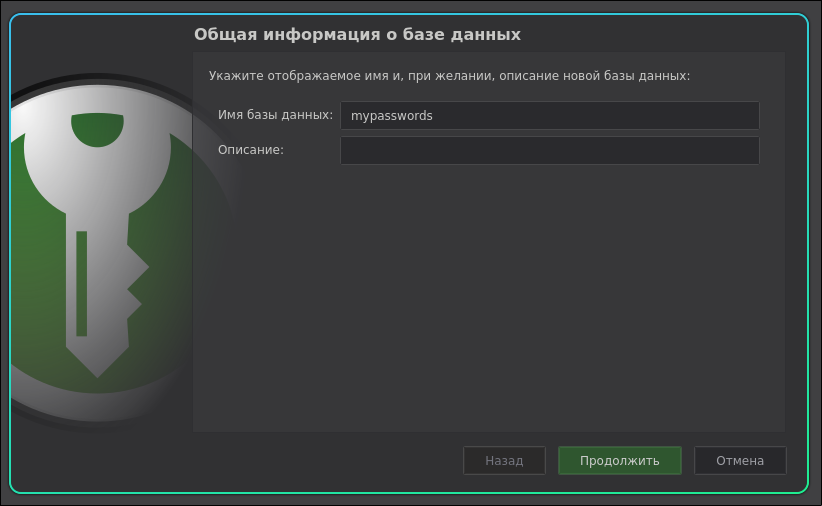
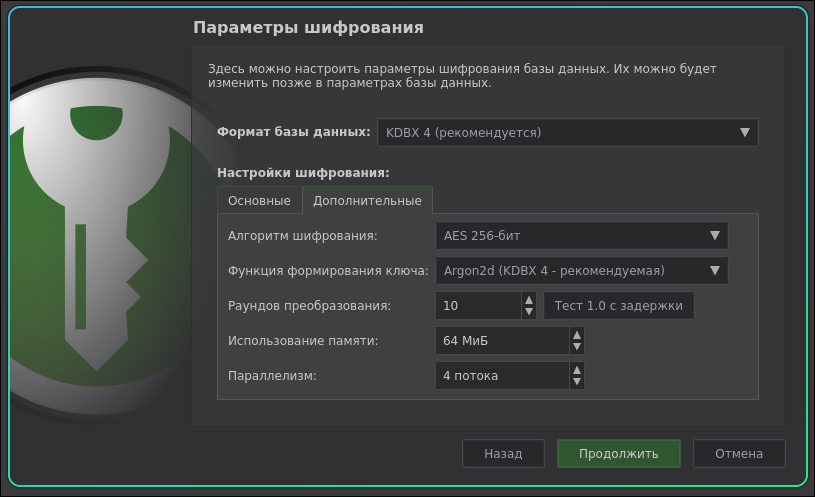
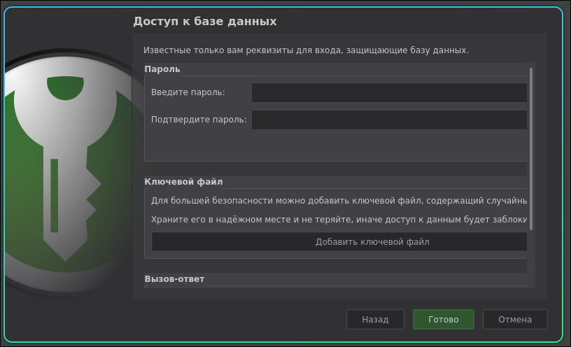
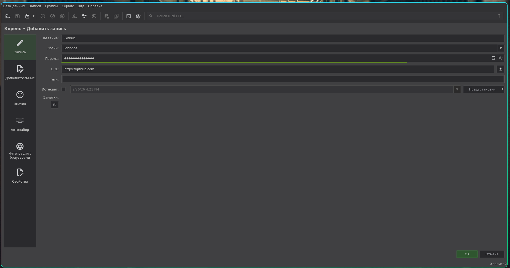
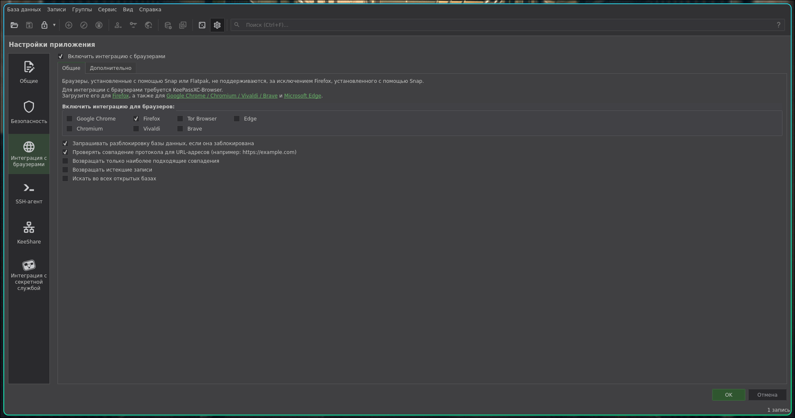
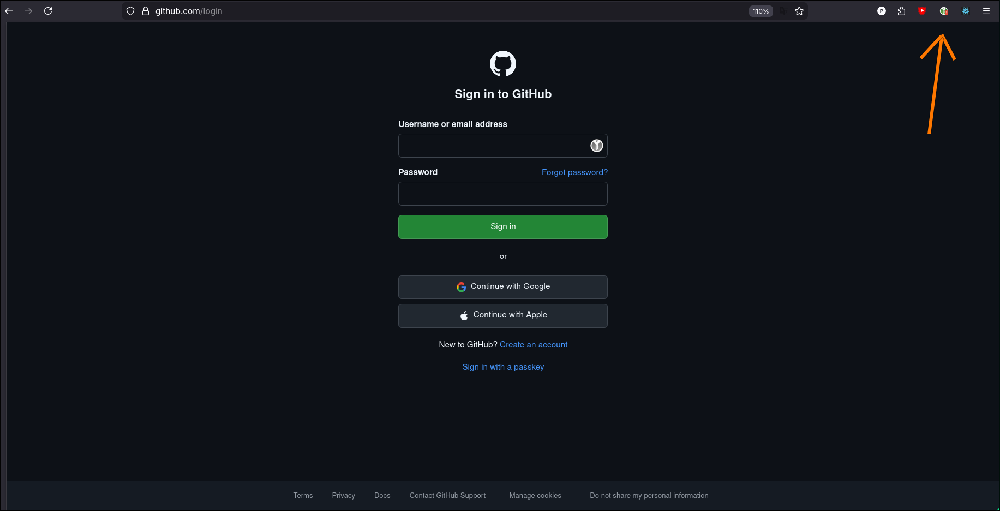
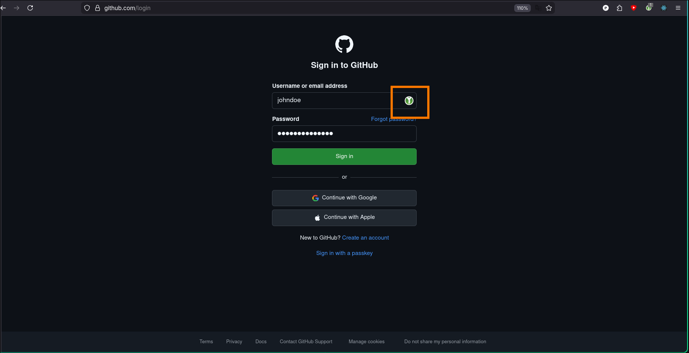
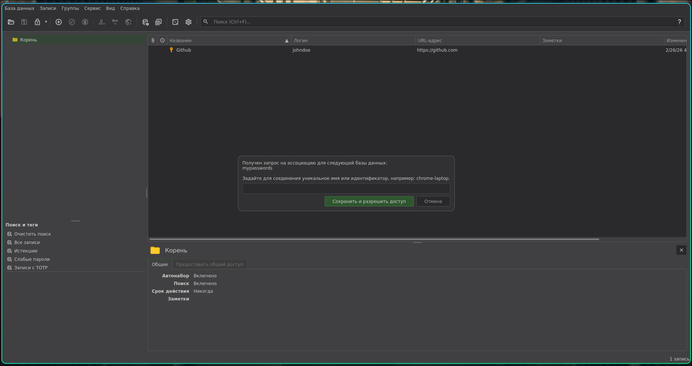
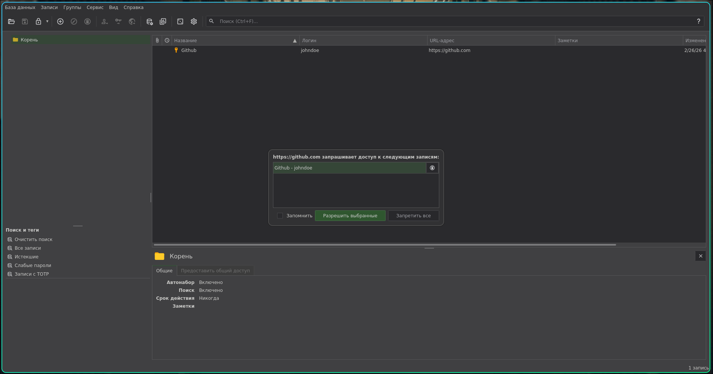

На рынке есть большое количество решений для облачного хранения паролей - 1Password, Google Passwords, LastPass. Почти все они выполняют свою задачу хорошо, но имеют пару недостатков - вендор-лок (ваши данные находятся не у вас, вы зависите от сервиса) и проприетарность кода (вам не дадут знать о том как код устроен в действительности и какие уязвимости и бэкдоры он скрывает). Учитывая интимный характер таких данных как личные пароли это может показаться критическим при хранении действительно важных паролей.

Конечно, есть другие решения, с открытым исходным кодом, такие как **KeepassXC**, который хранит пароли в зашифрованной базе данных с расширением `.kdbx`. Это еще и мощный инструмент управления паролями. Но в исходном виде, особенно после облачных решений он может показаться менее удобным, потому что нужно проделать работу по восстановлению привычных функций, таких как - автозаполнение паролей в браузере и доступ со всех устройств.

Именно это и будет проделано в данной статье.

## Качаем KeepassXC

[ссылка](https://keepassxc.org/)

## Первичная настройка

1. Создаем базу данных, называем ее **passwords** и кладем в удобное место на своем компьютере. Можете сразу же положить ее в любимое облако, чтобы сделать базу в будущем доступной со всех устройств.
2. Параметры шифрования оставляем как есть.
3. Создаем мастер пароль для своей базы данных. Его надо запомнить и он должен быть сложным.

скрины:









*опционально*

Есть один способ сделать пароль и сложным и запоминаемым, для тех кто знаком с командной строкой.
Используем эту команду в терминале: `pwgen -1 -0 -n 12 50` и получаем примерно такой вывод:

```sh
Eihai4Thu5shie
vi2Ueteetahpal
xei0oeWae2leij
Iethu0ohZeitoh
ohG8OaPh8ohcoo
biep9liechiM0a
ieKahw4chuYohm
ohpigoapoh3Ung
Ahghi4vohl8pho
Eshoo9saingahs
```

Данные пароли более мнемонические и запомнить их проще. Но они все еще считаются слабыми, поэтому добавьте или замените часть символов на символы из этой группы: `!#(){}[]%$+@`. Если все сделано правильно то **KeepassXC** отметит что пароль хороший. Двигаемся дальше.


## Автозаполнение для браузера

**KeepassXC** имеет сосредоточенную на безопасности архитектуру и его расширение для браузера не исключение. Есть особенности взаимодействия: расширение не будет иметь доступа к вашим паролям в базе данных, если десктопное приложение закрыто. Также, вам необходимо дать доступ к тем группам с паролями, к которым вы хотите чтобы у расширения был доступ.

По порядку:

1. Создаем первую тестовую запись - название, пароль и url ссылку для сайта, к которому мы хотим сохранить доступ.



3. В вашем браузере из магазина расширений устанавливаем расширение **KeePassXC-Browser**
4. Теперь убедитесь что десктопное приложение активно, что оно не закрыто
5. Включаем в десктопном приложении интеграцию с браузерами.



6. В тулбаре с расширениями нажимаем на иконку **KeePassXC-Browser** и нажимаем Connect а потом нажимаем на кнопку автозаполнения.






7. **KeepassXC** попросит дать пару подтверждений. Одно для ассоциации, а второе конкретно насчет разрешения вставки пароля. В первом напишите имя ассоциации - используйте **имя браузера + тип устройства**, например mozilla-pc или chrome-laptop. Во втором поставьте галочку запомнить и нажмите подтвердить.





Готово. Теперь автозаполнение в браузере работает.

## Настройка для смартфона

Для того чтобы использовать базу данных **KeepassXC** на смартфоне надо перенести базу данных **passwords.kdbx** в ваше любимое облако. После этого понадобится приложение, которое умеет работать с расширением `.kdbx`. Я рекомендую Strongbox.

Далее нужно просто открыть при помощи приложение базу данных (которую вы переместили в облако) и доступ к вашим паролям получен.

Можно еще улучшить пользовательский опыт, указав в качестве основного хранилища паролей Strongbox на iPhone или Android, и включить автозаполнение.